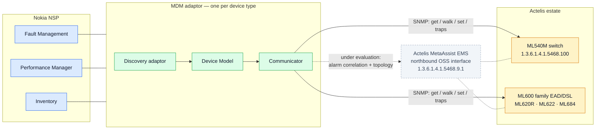

# Actelis adaptors for Nokia NSP

Nokia NSP device adaptors for Actelis network equipment, built via
Model-Driven Mediation (MDM): discovery adaptor + Device Model + Communicator
per device type, managed by **direct SNMP** to each device.

This is a reworked version of
[`mmorrow24work/NSP-adapters`](https://github.com/mmorrow24work/NSP-adapters)
following an independent review. **Start with [`REVIEW-FINDINGS.md`](REVIEW-FINDINGS.md)**
— 20 findings, severity-rated, each with what was done about it.
[`ROADMAP.md`](ROADMAP.md) has the revised plan.

---

## What this is, in one paragraph

Two Actelis device families, no EMS in the path, no NETCONF. The MIBs have
been analysed, the SNMP row-creation protocol has been proven end-to-end
against a lab switch, alarm and PM mapping tables have been derived from
vendor MIB text, and a standalone Python Communicator prototype polls both
families and stores normalised data. NSP/SDK access is the current gate:
everything past "build the Device Model in NSP's actual schema" waits on it.

## Architecture



Solid lines are the decided path — direct SNMP to each device, no EMS
dependency. The dashed path is the EMS northbound interface the original
decision never examined; it is now an evaluation item, not a rejection.
See [ADR-0001](docs/adr/0001-direct-snmp-vs-ems.md).

## Scope

| Device type | Products | OID root | Role |
|---|---|---|---|
| **ML600 family (EAD/DSL)** | ML620R, ML622, ML684 and other `Models` enum variants | `1.3.6.1.4.1.5468.510`, `…5468.4`, `…5468.5` | Copper line termination — DSL sync, line stats, EVC PM, alarms |
| **ML540M switch** | ML540M | `1.3.6.1.4.1.5468.100` | L2 aggregation/access — VLAN, LACP, LLDP, QoS, ACL, MSTP, ERPS, EVC |

**Two device types, not four.** The original queued questions to Actelis
asking what ML622 and ML684 are. `ACTELIS-SERV-MON-MIB`'s `Models` textual
convention answers it: both are ML600-family devices already covered by the
MIB archive in this repo, identifiable at discovery time from
`servMonSystemModel`. See [ADR-0003](docs/adr/0003-device-type-scoping.md).

---

## What changed, and why

### Fixed — silently wrong data

**Table row indices were truncated to the last sub-identifier.** Correct for
single-component indices; wrong for the Y.1731 LM/DM tables (2 components)
and the HDSL2-SHDSL interval tables (5: `ifIndex, invIndex, endpointSide,
wirePair, intervalNumber`). Two consequences: a per-row delay *unit* could be
paired with a delay *value* from a different measurement interval — a 1000×
error in `us` vs `ns` — and archived PM bins carried no port, wire pair or bin
number at all, making the archive unusable for its stated purpose. Now decoded
properly (`snmp/oid.py`), with the index travelling on every sample and
regression tests for both failure modes.

**The row-editor helper staged every field as a string.** The only shipped
spec has an `IpAddress` column and an integer column, and the lab script that
proved the protocol used `s`, `a` and `i` — so the shipped convenience method
could not be used with the shipped spec. Fields now carry MIB-derived types,
and rather than hand-writing specs, all **63 row-editor tables** are generated
from the MIBs.

**Alarms were a duplicate stream, not state.** Every standing alarm was
re-inserted on every 60-second poll (~1,440 rows/day each), with no clear
event and no correlation key; `alm-Cleared(2)` was read but ignored on the
poll path while the trap path honoured it. Now a proper state machine emitting
raise/change/clear, reconciled against each full poll, surviving restart.

### Fixed — premises that were wrong

**"SNMPv2c only, no SNMPv3 support evident."** The ML540M implements full
SNMPv3: USM users, MD5/SHA, DES/AES, `authPriv`, VACM views and access
groups — all configurable over SNMP. Cleartext on the switch is a choice, not
a constraint. This was missed because `ML540M-SNMP-MIB` is one of 30 modules
with zero coverage in the attribute schema. See
[`docs/security-posture.md`](docs/security-posture.md).

**The direct-SNMP-vs-EMS decision never examined the EMS interface.**
`NMS-ALARM-MIB.my`, in the archive committed to the repo, is the Actelis
MetaAssist EMS northbound OSS interface: cross-device alarm table with a
stable `alarmID`, `alarmAdded`/`Cleared`/`Modified` notifications, and a
topology table with parent/child relationships — precisely the three gaps in
the direct-SNMP design. The decision still stands, but as a **hybrid**.
See [ADR-0001](docs/adr/0001-direct-snmp-vs-ems.md).

**Two vendor questions were answerable from the repo.** The frame-loss and
frame-delay units the docs called "unconfirmed, needs a live modem or Actelis
documentation" are stated in the MIB's own `DESCRIPTION` text — *"provided as
1 = 0.0001%"*, *"measured in microsecond units"*. Including a 10× trap:
measured FLR and the MEF-10.2 FLR *objective* use different scales in the same
MIB. See [`docs/mib-analysis/units-resolved.md`](docs/mib-analysis/units-resolved.md).

### Added — things that were missing

* **MIB conformance testing.** Every OID constant and index spec is checked
  against the vendor archives on every CI run, so a MIB revision that moves an
  object fails the build instead of silently mis-polling. This is also what
  turns firmware/MIB drift from a review problem into a mechanical one.
* **Error taxonomy, retry and backoff.** Transient failures retry with
  exponential backoff and jitter; deterministic ones (`noSuchObject`,
  `authorizationError`, `wrongType`) never do. Unimplemented subtrees are
  recorded once as capability gaps rather than retried forever.
* **Idempotent storage.** Re-polling the same 96 bins no longer inserts 96
  more rows.
* **Credentials out of the repo**, resolved from environment variables, with
  an opt-in mode that keeps the community string off the process command line.
* **An executable FCAPS acceptance suite** — 63 tests across Fault,
  Configuration, Accounting, Performance and Security, written as acceptance
  criteria rather than unit tests, and runnable both offline and against a
  real device. It turns `docs/fcaps-parity.md` from a checklist into
  something that fails a build. See
  [`docs/fcaps-test-plan.md`](docs/fcaps-test-plan.md).
* **Security, testing, drift and coverage-gap docs**, four ADRs, and rewritten
  vendor-question lists.

### Kept, because it was right

The OID analysis — **every one of the 40+ hardcoded OIDs was verified correct
against the MIBs**. The row-editor protocol writeup, which matches the textual
convention verbatim and whose lab capture decodes byte-for-byte. Both mapping
CSVs, byte-identical, including the confirmed/inferred discipline. The servmon
recovery analysis, independently reproduced. The "no traps in the feature
MIBs" correction. The net-snmp CLI backend, now behind an interface. The
drift-corrected scheduler.

---

## Layout

```
REVIEW-FINDINGS.md     20 findings, severity-rated, with resolutions
ROADMAP.md             revised plan + 6 new workstreams
docs/
  adr/                 architecture decisions (direct-SNMP, MDM vs MDC,
                       device-type scoping, row-editor concurrency)
  mib-analysis/        coverage gaps, resolved units, servmon recovery
  vendor-questions/    rewritten lists for Actelis and Nokia
  security-posture.md  SNMPv3, credential handling, lab checklist
  testing-strategy.md  the three test layers + lab checklist
  fcaps-test-plan.md   the FCAPS acceptance suite, pillar by pillar
  firmware-mib-drift.md
  fcaps-parity.md
  lab-results/         raw captures from the 2026-09-18 validation runs
mibs/actelis/          vendor MIB archives, unmodified (the evidence base)
data/
  oid-maps/            raw MIB-derived OID maps
  attribute-schema/    normalised per-device-type schema (2,583 objects)
  mapping-tables/      alarm severity + PM counter mappings
tools/
  mibscan.py           independent SMIv2 parser (second opinion, and the
                       engine behind conformance testing)
  gen_row_editor_specs.py   generates typed specs for all 63 tables
  build_attribute_schema.py / build_alarm_pm_mapping.py / extract_servmon.py
  lab/                 SNMP validation scripts for real hardware
src/actelis_mediation/
  snmp/                transport: backend interface, net-snmp impl, OID/index
  model/               units, alarm state, table index specs
  poll/                per-device-type collection
  rowedit/             VTSSRowEditorState protocol + 63 generated specs
  traps/               snmptrapd decoding
  store/               SQLite persistence
tests/                 47 unit / conformance / regression tests
  fcaps/               63 FCAPS acceptance tests, one module per pillar
```

## Getting started

```bash
pip install -e ".[dev]"
make test          # 110 tests, incl. conformance against the vendor MIBs
make fcaps         # the FCAPS acceptance suite, offline
make verify        # every OID constant vs the MIBs
make lint
make diagrams      # check every mermaid block still renders

cp etc/devices.yaml.example etc/devices.yaml   # edit; credentials via env
export LAB_SWITCH_RO=... LAB_SWITCH_RW=...
actelis-mediation --config etc/devices.yaml poll-once --device lab-switch-01
actelis-mediation --config etc/devices.yaml alarms  --device lab-switch-01
```

Regenerating derived artefacts (all reproducible from the vendor archives;
CI fails if they are stale):

```bash
make specs      # rowedit/specs.py from the MIBs
make schema     # attribute-schema CSVs
make mapping    # alarm/PM mapping tables
```

## Status, stated honestly

* **ML540M switch** — lab-validated 2026-09-18: identity, LACP table, SNMP
  SET, and row create/delete via `VTSSRowEditorState` end to end. One firmware
  gap found: the proprietary LLDP status subtree is absent on `00.00.16`.
  *The standard `LLDP-MIB` was never tried* — five minutes that could retire
  that risk (`docs/testing-strategy.md` L2).
* **ML600 family** — MIB analysis only. No unit has ever been reachable.
* **The Communicator has never run against hardware.** Every OID is verified
  against the MIBs and the logic is unit-tested against captured output, but
  the bash scripts are the only thing that has touched a device. Closing that
  is item N1 on the roadmap and it needs about an hour.
* **Trap decoding is unproven.** No trap payload has ever been captured from
  either family. The decoder matches the MIB definitions; "matches the MIB"
  and "matches what the agent sends" are different claims.
* **NSP/SDK access remains the hard gate** for everything in Phase 1.

## Requirements

Python 3.11+. `net-snmp` CLI tools on `PATH` for live polling (not needed for
the test suite — everything is faked). `py7zr` for MIB conformance tests.
`@mermaid-js/mermaid-cli` only if you want to re-validate the diagrams.
