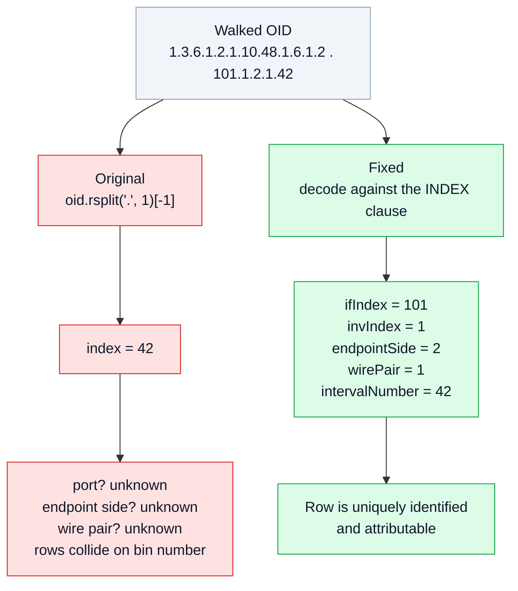
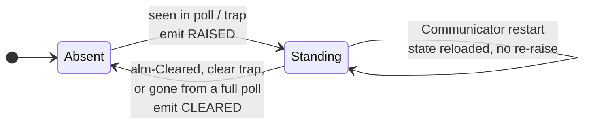

# Independent Review — NSP-adapters

**Reviewed:** `github.com/mmorrow24work/NSP-adapters` @ `1d71e57` (2026-09-19)
**Findings:** 26 — 20 from the review pass, 2 from writing the FCAPS
acceptance suite (F-21, F-22), 4 from the first run against real hardware
(F-23 … F-26)
**Method:** every claim checked against primary sources — the vendor MIB
archives parsed with an independently-written SMIv2 extractor
(`tools/mibscan.py`, deliberately not `smidump`), the raw lab captures in
`docs/lab-results/`, and the code executed rather than read.

---

## Verdict up front

The MIB-level work is **better than most vendor-integration projects ever
get**. I tried to break the OID analysis and could not: every one of the 40+
hardcoded OIDs in the codebase resolves to exactly the MIB object it claims,
the `VTSSRowEditorState` protocol writeup matches the textual convention
verbatim, the row-editor lab capture decodes byte-for-byte, and the two
headline counts I could check independently (`ML620R-MIB` 290 objects / 164
read-write; exactly one SMIv2 `Entry` sub-identifier violation in
`ACTELIS-SERV-MON-MIB`) are exactly right. The confirmed/inferred flagging
discipline in the mapping tables is genuinely good practice and I kept it.

The defects are **not in the OIDs — they are in the semantics layered on top
of them**, and in scope. Three things drive almost every finding below:

1. **Table indices are truncated to one sub-identifier**, so PM data is
   unattributable and delay units can be mispaired by a factor of 1000.
2. **Alarms are treated as a list, not a state machine**, so the fault
   output is unusable by NSP Fault Management as-is.
3. **Roughly half the switch MIB surface was never analysed** — and the
   unanalysed half contains the SNMPv3 support that invalidates the
   project's entire security premise.

Two of the four open questions queued for Actelis are **already answered
inside the MIB archive that is committed to the repo**.

**Severity key** — C1 silently produces wrong data or blocks the goal; C2
materially wrong or will force rework; C3 correctness/robustness gap; C4
accuracy or hygiene.

---

## C1 — Silently wrong data

### F-01 · Table row indices truncated to the last sub-identifier
`communicator/poller.py`, every table poller: `index = oid.rsplit(".", 1)[-1]`.

That is correct only for single-component indices. Verified against the MIBs:

| Table | Actual `INDEX` clause | Components |
|---|---|---|
| `ml540mPerfMonitorStatusStatisticsDmEntry` | `DmIntervalId, DmEntryId` | **2** |
| `ml540mPerfMonitorStatusStatisticsLmEntry` | `LmIntervalId, LmEntryId` | **2** |
| `hdsl2Shdsl15MinIntervalEntry` | `ifIndex, hdsl2ShdslInvIndex, hdsl2ShdslEndpointSide, hdsl2ShdslEndpointWirePair, hdsl2Shdsl15MinIntervalNumber` | **5** |



Two consequences, both silent:

* **The DM unit bug.** `poll_pm_switch_dm` keys `units_by_index` on the last
  sub-identifier, so a `DmUnit` of `us(0)` read from interval 1 can be applied
  to delay values from interval 2 whose real unit is `ns(1)`. That is a
  1000× error in the exact field `alarm-pm-mapping.md` warns "silently
  corrupts every delay/loss value downstream". The code written specifically
  to avoid that trap reintroduces it through the index.
* **PM bins have no identity at all.** Samples record metric, value and a
  `bin_window` string — never `ifIndex`, endpoint side, wire pair or bin
  number. For a job whose stated purpose is "poll and archive the device's
  interval bins before they roll off", the resulting archive cannot say which
  port or which 15-minute window any number came from.

**Fixed.** `snmp/oid.py` implements real SMIv2 index decoding (integers,
`IpAddress`, length-prefixed strings); `model/tables.py` declares each table's
index; rows are joined on the *full* suffix. The decoded index travels with
every sample. Regression tests in `tests/test_oid_index.py` and
`tests/test_poller.py` pin both failure modes, including the two-DM-rows-
sharing-an-`entryId` case. `tests/test_mib_conformance.py` re-checks each
index spec against the MIB's own `INDEX` clause, so a vendor revision that
adds a component fails the build.

### F-02 · Row-editor `stage()` sends every field as a string
`communicator/row_editor.py`. `stage()` hardcodes net-snmp type `s` for all
fields. The only spec shipped, `SNMP_COMMUNITY_ROW_EDITOR`, has an
`IpAddress` column and an `Integer32(0..32)` column — and the lab script that
*proved* the protocol used `s`, `a` and `i` respectively
(`tools/lab/test_row_editor.sh` lines 60-63). So the shipped convenience
method cannot be used with the shipped spec: the agent answers `wrongType`.
The flagship "fully proven" component has a broken entry point.

**Fixed.** Fields carry their net-snmp type char, derived from MIB `SYNTAX`.
Rather than hand-write specs — the step that produced this bug —
`tools/gen_row_editor_specs.py` generates them for **all 63 row-editor tables**
in the MIB set. `tests/test_row_editor.py` asserts the generated community
spec reproduces `s`/`a`/`i` exactly, and `tests/test_mib_conformance.py`
asserts every generated field OID is a real, writable MIB object.

### F-03 · Alarms are a duplicate stream, not state
`poll_alarms_switch` / `poll_alarms_dsl` return every row on every poll and
`store.record_alarm_event` inserts all of them. At the documented 60-second
alarm interval one standing alarm becomes **1,440 identical rows per day**.
There is no clear event, no correlation key, and no way to distinguish a new
alarm from one standing for a week. NSP Fault Management — like any X.733
system — consumes raise/change/clear transitions.

Worse, `currentAlarmState` (`VTSSAlarmState ::= INTEGER { alm-Set(1),
alm-Cleared(2) }`) *is* read but only concatenated into a text field, so a row
the device has already cleared is still recorded at its alarm severity. The
trap path handled this correctly; the poll path did not — the two disagreed.



**Fixed.** `model/alarms.py` keeps standing alarms keyed on a stable
identity (alarm type + port for the switch, TL1 AID + name for the modem —
explicitly *not* `currentAlarmRowId`, which is a reusable slot number) and
emits only transitions. Cleared state is honoured on both paths. State
reloads from the store on startup so a restart does not replay every standing
alarm as newly raised. Covered by `tests/test_alarm_state.py`.

---

## C2 — Materially wrong, or will force rework

### F-04 · "SNMPv2c only, no SNMPv3 support evident" is wrong for the switch
`nokia-vendor-questions.md` Q18 and the whole Security section of
`fcaps-parity-with-ems.md` rest on this. The ML540M MIB set says otherwise:

```
VTSSSnmpVersion      ::= INTEGER { snmpV1(0), snmpV2c(1), snmpV3(2) }
VTSSSnmpSecurityLevel::= INTEGER { snmpNoAuthNoPriv(1), snmpAuthNoPriv(2), snmpAuthPriv(3) }
VTSSSnmpAuthProtocl  ::= INTEGER { snmpNoAuthProtocol(0), snmpMD5AuthProtocol(1), snmpSHAAuthProtocol(2) }
VTSSSnmpPrivProtocl  ::= INTEGER { snmpNoPrivProtocol(0), snmpDESPrivProtocol(1), snmpAESPrivProtocol(2) }
VTSSSnmpSecurityModel::= INTEGER { any(0), v1(1), v2c(2), usm(3) }
```

`ml540mSnmpConfigUserTable` provisions USM users with auth and privacy
passwords; `...AccessGroupTable` and `...ViewTable` are VACM. All of it is
configurable over SNMP through the row-editor mechanism the project already
proved. So cleartext community strings on the switch are a **choice, not a
constraint**, and the mitigation is not "put it on an OOB network" but
"configure authPriv".

This was missed for a traceable reason: `ML540M-SNMP-MIB` is one of the 30
modules with zero coverage in the attribute schema (F-06). The coverage gap
and the security error are the same mistake.

**Fixed** in `docs/security-posture.md` and the revised Nokia questions; the
SNMPv3 objects are now in `poll/oids.py`. The modem side ships
`SNMP-FRAMEWORK-MIB` (engine ID, auth/priv protocol registries), which is
suggestive but not conclusive — flagged as a lab check, not a claim.

### F-05 · The direct-SNMP vs EMS decision was made without examining the EMS interface
`architecture-decision-direct-snmp.md` says the decision was "Confirmed via
MIB analysis", and argues both devices "run a resident SNMP agent on the
device itself … not an EMS-mediated pseudo-MIB". It never mentions
`NMS-ALARM-MIB.MY`, which sits in the same `ML600_MIB.7z` in the repo:

```
actelisMetaAssistEms ::= { actelis 9 }
  "NMS Server Open Alarms enable external OSS to read the open alarms table
   and receive trap for any alarm change"
```

It defines a cross-device `alarmTable` with a **stable `alarmID`**, a closed
numeric severity enum (`warning(3) minor(4) major(5) critical(6)` — the X.733
ordering), `alarmSource` / `alarmManagedObject` / `alarmType`,
`alarmAdded`/`alarmCleared`/`alarmModified` notifications, **and a
`topologyTable`** carrying `deviceParent` and a device-role enum
(`bst-central`, `bst-remote`, `cpe`, `backhaul`).

Those are precisely the three weaknesses of the direct-SNMP design: no stable
alarm correlation ID (F-03), no clear semantics, and no topology source once
LLDP turned out to be missing on the tested firmware.

This does not make the decision wrong — per-device access is genuinely better
for configuration and PM, and an EMS dependency is a real cost. It makes the
*evidence base* incomplete, and an ADR that does not mention the alternative
it rejected will not survive review by anyone who opens that archive.

**Addressed** in `docs/adr/0001-direct-snmp-vs-ems.md`, rewritten to record
the EMS northbound interface explicitly and to recommend a **hybrid**:
direct SNMP for config/PM/inventory, EMS northbound evaluated for fault
aggregation and topology.

### F-06 · Roughly half the switch MIB surface is unanalysed
The attribute schema covers 2,016 objects. The archive contains **4,527
`OBJECT-TYPE` definitions across 57 files** (the docs say "4,582 objects
across 27 MIB files" — the object count is close enough, the file count is
wrong by 30). **30 modules / 2,206 objects have zero coverage**, including:

| Module | Objects | Why it matters |
|---|---|---|
| `ML540M-MEP-MIB` | 535 | 802.1ag CFM — **the alarm mapping already cites this MIB**, so the alarm work and the schema were built from different MIB sets |
| `ML540M-MPLS-MIB` | 408 | The switch does MPLS. Unmentioned anywhere, and NSP is an MPLS-centric platform |
| `ML540M-PTP-MIB` | 176 | IEEE 1588 — routinely a hard requirement in critical-infrastructure networks |
| `ML540M-AUTH/USERS/PRIVILEGE/ACCESS-MANAGEMENT/SSH/HTTPS/SYSLOG` | 158 | The FCAPS Security section discusses these; none are in the schema |
| `ML540M-SNMP-MIB` | 67 | Source of the write-community bootstrap **and** the SNMPv3 finding above |
| `ML540M-DDMI-MIB` | 38 | Optical transceiver diagnostics — classic PM + threshold alarms, absent from the PM mapping |

The DSL side has the same shape: `FTTN-MIB` (**521 objects**, larger than
`ML620R-MIB` itself) is untouched, as are standard `ENTITY-MIB` (39 — the
normal way NSP builds an equipment hierarchy), `IF-MIB` (66 — the universal
interface-counter PM source, zero rows in the PM mapping), `LLDP-MIB` (180),
`DOT3-OAM-MIB` (72) and `IEEE8021-CFM-MIB` (156).

**Addressed** in `docs/mib-analysis/coverage-gaps.md`, with the full
per-module inventory and a prioritisation.

### F-07 · The LLDP "firmware gap" conclusion was wrong — RESOLVED 2026-09-19
The 2026-09-18 lab run walked the **proprietary**
`ml540mLldpStatusNeighborsInformationTable`
(`1.3.6.1.4.1.5468.100.34.1.3.2`), got `No Such Object`, and concluded LLDP
topology discovery "cannot be assumed for the switch adaptor". The standard
**`LLDP-MIB` (`1.0.8802.1.1.2`)** was never tried — despite shipping in the
vendor's own ML600 archive.

**Tested on 2026-09-19** (`docs/lab-results/ml540m-lldp-20260919.txt`). The
standard MIB *is* implemented on firmware `00.00.16`:

| Object | Value |
|---|---|
| `lldpPortConfigAdminStatus` (ports 1-10) | `3` = txAndRx — LLDP actively running |
| `lldpLocChassisId` | `00-03-85-92-04-10` (OUI `00:03:85` = Actelis) |
| `lldpLocSysName` | `XMJ1-XMJ2-M540-02-010` |
| `lldpLocSysDesc` | `00.00.16 2024-08-05T18:39:39+08:00` |

So only the **proprietary** status subtree is missing — that half of the
original finding stands. The standard path works.

The neighbour table itself is still untested, for a reason the original run
also missed: **all 30 interfaces are `ifOperStatus = down(2)`**. With no link
up there is no neighbour to learn, so an empty `lldpRemTable` is the correct
result rather than a defect. Bringing up one link to an LLDP speaker and
re-walking `1.0.8802.1.1.2.1.4.1` closes it.

**Consequence:** topology discovery is *not* a flagged risk for the switch —
it just has to go through the standard MIB rather than the vendor branch.
That materially reduces the pressure on the EMS `topologyTable` as the only
identified topology source (ADR-0001).

**Two side findings from the same walk**, both of which close gaps recorded
elsewhere in this review:

* **Standard `IF-MIB` is implemented on the switch** — `ifOperStatus`
  responded for 30 entries against `portCount = 10` (physical ports plus
  VLAN/aggregate/internal interfaces). `IF-MIB` was listed in F-06 as an
  uncovered module with no rows in the PM mapping; it is now confirmed
  available as an interface-counter PM source.
* **`lldpLocSysName` and `lldpLocChassisId` are better inventory keys than
  `productModel`** — a real deployed device name and the chassis MAC, both
  over a standard MIB. `lldpLocSysDesc` carries firmware version and build
  date, which is a cheap per-device drift signal (W1).

### F-08 · Two Actelis vendor questions are answered inside the repo's own archive
`actelis-vendor-questions.md` Q1-Q4 ask which product lines ML540/ML622/ML684
correspond to, and Q9 asks for the units of the servmon FLR/FD/percentile
objects. Both are answerable from `ML600_MIB.7z`, today:

**Model scope.** `ACTELIS-SERV-MON-MIB`'s `Models` textual convention is a
closed 53-value enum of Actelis NE models, read back from the device via
`servMonSystemModel`. It contains `ml684-501RG0048(11)` and
`ml684d-501RG0220(50)`; `ml622-501R00016(28)`, `ml622-501RG0016(29)`,
`ml622i-501RG0062(30)`, `ml622i-501RG0162(46)`. **ML622 and ML684 are both
ML600-family devices covered by the archive already in the repo.** No `ml540`
appears — consistent with ML540 being the switch line. So the scope extension
is probably *two* device types with model variants, not four device types.

**Units.** The docs say the FLR/FD/percentile scales "aren't stated in the
SNMP `SYNTAX`… flagged `unconfirmed` rather than guessed. Needs either a live
modem or Actelis's own documentation." They are stated — in the `DESCRIPTION`,
which a SYNTAX-only reading misses:

| Objects | Stated scale |
|---|---|
| `flFlr*FLR*` (measured, 14 objects) | *"provided as 1 = 0.0001% , i.e. 50 means 0.005%"* |
| `fdFdv*FD`, `*FDV` (8 objects) | *"measured in microsecond units. 1000 microseconds = 1 msec"* |
| `servMonMEFServAvailObjective*`, `...1wayFLRObjectiveL` | *"Unit 1 = 0.001%. 90000 means >= 90% FLR"* |
| `servMonMEFServ1wayFDObjectiveD` | *"One-way Frame Delay Objective, in microseconds"* |
| `portEgress/IngressUtilization` | *"units of 1 = 0.001% , i.e. 5985 means 5.985%"* |
| `inBWPolicyDiscardedBW` etc. (6) | *"Measured in Kbps"* |

Note the trap that falls out of this: **measured FLR is 1 = 0.0001% while the
MEF-10.2 FLR *objective* is 1 = 0.001%** — same quantity, same MIB, scales a
factor of 10 apart. Comparing a measurement to its threshold without
rescaling gives a silently wrong verdict.

**Fixed.** `model/units.py` encodes each scale with its verbatim evidence
string and a `verified` flag; `tests/test_units.py` checks them against the
MIB's own worked examples. The switch-side `Lm*LossRate` scale *is* genuinely
unstated anywhere — that one stays a vendor question, and the code refuses to
apply the assumed MEF milli-percent scale silently.

---

## C3 — Correctness and robustness

### F-09 · One missing OID discards the whole response
`snmp_client._run` scans combined stdout+stderr for `No Such Instance` and
raises for the entire call. On a multi-OID GET, one unimplemented identity
OID destroys the values that *did* return — on a device family already known
to ship firmware with missing subtrees. **Fixed:** per-varbind parsing;
present values returned, absent ones reported and recorded once as a
capability gap.

### F-10 · No retry or backoff; retries applied where they are harmful
Beyond net-snmp's own `-r 1` there is no retry logic, and no distinction
between transient and deterministic failures. **Fixed:** exponential backoff
with jitter for timeouts only; `SnmpNoSuchObject`, `SnmpAuthorization` and
`SnmpBadValue` never retry (retrying auth failures can trip lockouts on
AAA-backed devices); SET retries capped at one to avoid double-applying.

### F-11 · Hardcoded 30-second subprocess timeout truncates large walks
`subprocess.run(..., timeout=30)` is fixed regardless of configured timeouts.
A 96-bin × ports × wire-pairs × endpoint-sides HDSL2-SHDSL walk exceeds it on
any slow link, and `snmpwalk` (GETNEXT, one request per row) makes that
likely. **Fixed:** separate `walk_timeout_s` (default 300s) and
`snmpbulkwalk` with `-Cr` when available.

### F-12 · Stale row-editor reservation has no recovery path
`VTSSRowEditorState` has **no reservation timeout** — the TC's state machine
leaves `RESERVED` only via CLEAR or COMMIT. A Communicator killed between
reserve and commit leaves the editor locked for *every* manager, including
the CLI and any other NMS, permanently. The original raised "Clear it by hand
before retrying". The TC places no restriction on who may write CLEAR, so
programmatic recovery is available. **Fixed:** `reclaim_stale=True` force-
clears with a warning; the error otherwise names the holding manager ID and
explains it will not self-clear. Also now documented as a clustering
constraint — it is a device-wide mutex, and NSP normally runs clustered
(`docs/adr/0004-row-editor-concurrency.md`).

### F-13 · Re-polling duplicates the entire PM history
No uniqueness on PM rows: polling 96 historical 15-minute bins every 5 minutes
inserts all 96 every time — ~288 copies of each bin per day. **Fixed:**
`UNIQUE (device, source_object, index_key, bin_window, bin_id)` with
`ON CONFLICT DO NOTHING`, so the poll interval can be set for safety without
inflating the archive. `tests/test_store.py` polls the same 96 bins three
times and asserts 96 rows.

### F-14 · Community strings on the command line and in the repo
Communities are passed via `-c`, visible in `ps` to any local user on the
management host — and this handles *write* communities. `config/devices.yaml`
ships `public`/`private` inline. **Partly fixed:** credentials now resolve
from environment variables and the example config carries no secrets; a
`community_mode: snmp_conf` option writes a private `0600 snmp.conf` and sets
`SNMPCONFPATH` to keep the community off argv. That mode is **not** the
default and is marked as needing lab verification — net-snmp was not
available in this environment, and shipping an unverified credential path as
the default would repeat the mistake the missing `.0` taught.

### F-15 · Multi-line string values silently dropped
Line-by-line varbind parsing discards continuation lines, so a `sysDescr`
containing newlines — common — is truncated. **Fixed**, with a test.

---

## C4 — Accuracy and hygiene

### F-16 · `infer_unit()` could never assign dB or dBm
`build_attribute_schema.py` lowercases the description, then matches the
case-sensitive patterns `\bdBm\b` and `\bdB\b` against it. Neither can ever
match. Result: **zero** objects carried a dB unit, including
`efmCuPmePeerSnrMgn`, `efmCuPmeLineAtn` and `efmCuPmePeerLineAtn` — the DSL
line-quality metrics that matter most for a copper-plant adaptor.
**Fixed** (case-insensitive on the original text). Units also now derive from
the object's type and `UNITS` clause, not description text alone, and a new
`unit_source` column records the evidence for each. Unit coverage rose from
122 to 147 objects (DSL) and 371 to 551 (switch) with object counts unchanged.

### F-17 · All three generator scripts hardcode `/home/claude/NSP-adapters`
`build_attribute_schema.py`, `build_alarm_pm_mapping.py` and
`extract_servmon.py` all write to an absolute path under one user's home —
so "reproducible via `scripts/…`" is false on any other machine. Running
`build_alarm_pm_mapping.py` from a fresh clone silently creates
`/home/claude/NSP-adapters/docs/mapping-tables/` and writes there.
**Fixed:** all paths resolve relative to the repo. Both mapping CSVs
regenerate **byte-identical** to the originals, which is the evidence that
the content was right all along.

### F-18 · Documented counts drift from the MIBs
"4,582 objects across **27** MIB files" — there are **57**. The security-MIB
object counts in `fcaps-parity-with-ems.md` are each exactly one higher than
an `OBJECT-TYPE` count (AUTH 69 vs 68, USERS 13 vs 12, …), i.e. a
module-identity node counted as an object. Minor, but these numbers are
quoted to vendors. **Fixed:** counts regenerated from `tools/mibscan.py` and
now checked in CI.

### F-19 · `AlarmMapping` collision fix left a silent trap
The original found and fixed a real bug — ~20 switch fault-status rows all
using `source_value="TRUE"` collided under `(device_type, source_value)` — by
adding `lookup_by_object()`. Good catch. But `lookup()` was deliberately left
unchanged and still returns the first colliding row with no signal, and the
pollers still call `lookup()`. **Fixed:** collisions are detected at load and
`lookup()` warns when it resolves an ambiguous key.

### F-20 · Claims stated more strongly than the evidence supports
`nokia-vendor-questions.md` opens "all the work that doesn't need NSP/SDK
access is done", while `build-roadmap.md` lists four open Phase 0 items and
the Communicator has never been run against hardware. `communicator/README.md`
says "40 tests" in one place and the roadmap says 42 (42 is correct). These
are small, but the docs go to vendors. **Addressed** by rewriting the status
sections against what is actually demonstrable.

---

## Found later, while writing the FCAPS acceptance suite

Two defects that the original suite could not have caught, and neither could
my first review pass — both surfaced only when the code was asserted against
what a *fault manager* needs rather than against its own intentions.

### F-21 · C2 · `nsp_severity` sometimes holds prose, and the poller called `Severity()` on it

12 of the 50 alarm-mapping rows carry a cross-reference in the
`nsp_severity` column instead of a severity — e.g.
`(see alarmSeverity CR/MJ/MN/NA mapping above)` on alarm-*name* rows, whose
severity comes from a different column of the same device alarm. As an
authoring convention that is defensible; the problem is that both the poll
and trap paths did `Severity(row.nsp_severity)`, which raises `ValueError` on
those rows and takes down the whole collection cycle.

It has not bitten yet only because the DSL alarm path has never run against
hardware, and the switch rows it does touch happen to hold real severities.

**Fixed.** `model.alarms.parse_severity()` handles the cross-reference
convention, the empty case and any unknown value, degrading to
`Indeterminate` with a warning. No raw `Severity()` constructor call remains
on mapping data. `tests/fcaps/test_fault.py::test_severity_parsing_never_raises_on_any_mapping_row`
walks every row in the CSV.

### F-22 · C3 · The community string survived on a chained exception

After redacting the command line and tool output, one path still leaked:
`subprocess.TimeoutExpired` stringifies its own argv, which contains `-c
<community>`. `raise SnmpTimeout(...) from None` suppresses *display* of the
context but leaves the object reachable on `__context__`, so anything that
logs or serialises the exception chain gets the credential.

**Fixed.** The `TimeoutExpired` instance is scrubbed (`cmd`, `output`,
`stderr`) before it becomes the context. Asserted by
`tests/fcaps/test_security.py::test_community_never_reaches_an_exception_message`,
which drives the real `_run` path rather than a stub.

---

## Found on first contact with hardware (N1, 2026-09-19)

The first execution of the Communicator against the lab ML540M failed in two
seconds with a defect in this adaptor — not in the device, the MIBs or the
OIDs. Capture: `docs/lab-results/ml540m-poll-once-20260919.txt`.

### F-23 · C1 · `-Cr 25` emitted as two argv tokens, so every walk failed
net-snmp takes its `-C` sub-options **concatenated** with their value:
`-Cr25`, not `-Cr 25`. The backend emitted two tokens, so net-snmp read `25`
as the agent address, shifted `192.168.1.99:161` into the OID slot, and
aborted with a usage banner before sending a packet.

**Why nothing caught it:** `FakeBackend` answers at the Python level and never
builds a command line. Every assertion about walking concerned the *result*
of a walk; none concerned the call. That is a gap in the test strategy, not a
typo.

**Fixed.** Construction moved to `NetSnmpBackend.walk_args()` so it is
testable without invoking net-snmp; `tests/test_snmp_argv.py` asserts the
exact expected argv, that `-Cr` never appears as a bare token, and that AGENT
and OID stay the last two arguments.

### F-24 · C3 · A malformed command line was retried as if transient
The run burned two backoffs retrying a deterministic usage error, which
buried the real cause behind warnings that implicated the device.
**Fixed:** a `USAGE:` banner is now `SnmpInvocationError` — classified as a
bug in this code, never retried.

### F-25 · C2 · One failing section aborted the whole poll
The alarm walk failed, so the PM section never ran and the run taught us
nothing about it. `poll_device` caught only `SnmpNoSuchObject`; anything else
propagated out.
**Fixed:** each section is isolated, records a capability gap, and the poll
continues. Per-section errors are returned and printed by the CLI.

### F-26 · C1 · A failed alarm walk would have cleared every standing alarm
Latent, and more dangerous than the bug that exposed it. A full poll is
treated as authoritative — anything absent is cleared. But an *errored* walk
is not evidence of absence, and the reconcile step could not tell the
difference. On a device with 20 standing alarms, one transient SNMP failure
would have emitted 20 spurious clears into NSP.
**Fixed:** a failed walk skips reconciliation entirely. Two regression tests.

---

## What I kept, unchanged, because it is right

* **The row-editor protocol analysis.** Verified verbatim against the
  `VTSSRowEditorState` TC. The lab capture is real and self-consistent — the
  length-prefixed index `11.99.108.97.117.100.101.45.116.101.115.116` decodes
  to exactly `"claude-test"`, and the pre-existing `public`/`private` rows
  decode correctly too. This is the strongest asset in the project and it now
  generalises to 63 tables instead of one.
* **Both mapping-table CSVs**, byte-for-byte, including the
  confirmed/inferred discipline. Keeping `inferred` rows visible rather than
  laundering them into fact is exactly right.
* **The servmon recovery analysis.** Independently reproduced: exactly one
  `Entry` with a sub-identifier ≠ 1, and it is the one named. Root-cause
  writeup is precise and correct.
* **The "no traps in the feature MIBs" correction.** Confirmed: of 57 switch
  MIBs, only `ML540M-SYSTEM-MIB` defines any `NOTIFICATION-TYPE` — 13 alarm
  traps (GE ports 1-10 only) and 41 event traps. Catching and *correcting* an
  earlier wrong assumption in the doc is the right instinct.
* **Preserving SNMP textual conventions instead of flattening them.** Right
  call, and the right thing to tell Nokia.
* **The net-snmp CLI backend.** Rewriting it onto pysnmp would discard proven
  ground for no benefit. It is now behind an interface so the NSP SDK backend
  can replace it later.
* **The drift-corrected scheduler** and the decision to schedule from the
  intended time rather than from completion.

---

## Scoreboard

| ID | Severity | Finding | Status |
|---|---|---|---|
| F-01 | C1 | Table indices truncated to last sub-identifier | Fixed + regression tests |
| F-02 | C1 | Row-editor stages every field as a string | Fixed; 63 specs generated from MIBs |
| F-03 | C1 | Alarms duplicated, never cleared | Fixed; state machine + transitions |
| F-04 | C2 | "No SNMPv3" is wrong for the switch | Corrected; posture doc rewritten |
| F-05 | C2 | ADR never examined the EMS northbound MIB | ADR rewritten; hybrid recommended |
| F-06 | C2 | 2,206 switch + ~1,400 DSL objects unanalysed | Documented with prioritisation |
| F-07 | C2 | LLDP gap concluded without testing standard MIB | **Resolved 2026-09-19** — standard MIB works; only the vendor branch is missing |
| F-08 | C2 | 2 vendor questions answerable from the repo | Answered; units encoded in code |
| F-09 | C3 | One missing OID discards the whole GET | Fixed |
| F-10 | C3 | No retry/backoff; no error classification | Fixed |
| F-11 | C3 | 30s subprocess timeout truncates walks | Fixed; bulkwalk added |
| F-12 | C3 | No stale row-editor reservation recovery | Fixed; clustering ADR added |
| F-13 | C3 | Re-polling duplicates entire PM history | Fixed; idempotent upsert |
| F-14 | C3 | Communities on argv and committed to the repo | Partly fixed; env vars, opt-in hardening |
| F-15 | C3 | Multi-line string varbinds dropped | Fixed |
| F-16 | C4 | dB/dBm units could never be inferred | Fixed |
| F-17 | C4 | Generator scripts hardcode an absolute path | Fixed; output byte-identical |
| F-18 | C4 | Documented MIB counts drift from reality | Fixed; verified in CI |
| F-19 | C4 | `lookup()` still silently resolves collisions | Fixed; warns |
| F-20 | C4 | Status claims stronger than evidence | Rewritten |
| F-21 | C2 | `Severity()` called on prose cross-reference rows | Fixed; `parse_severity` + test |
| F-22 | C3 | Community leaked via chained `TimeoutExpired` | Fixed; exception scrubbed + test |
| F-23 | C1 | `-Cr 25` as two argv tokens — every walk failed | Fixed; argv now unit-tested |
| F-24 | C3 | Malformed command line retried as transient | Fixed; `SnmpInvocationError` |
| F-25 | C2 | One failing section aborted the whole poll | Fixed; sections isolated |
| F-26 | C1 | Failed walk would clear every standing alarm | Fixed; reconcile skipped |

**Not fixed, deliberately:** the switch `Lm*LossRate` scale (genuinely
unstated in any MIB — stays a vendor question, and the assumed scale is never
silently applied); trap payload decoding (still unverified — no trap has ever
been captured from either device, and no amount of code review changes that);
anything requiring an ML600-family unit or live NSP access.
