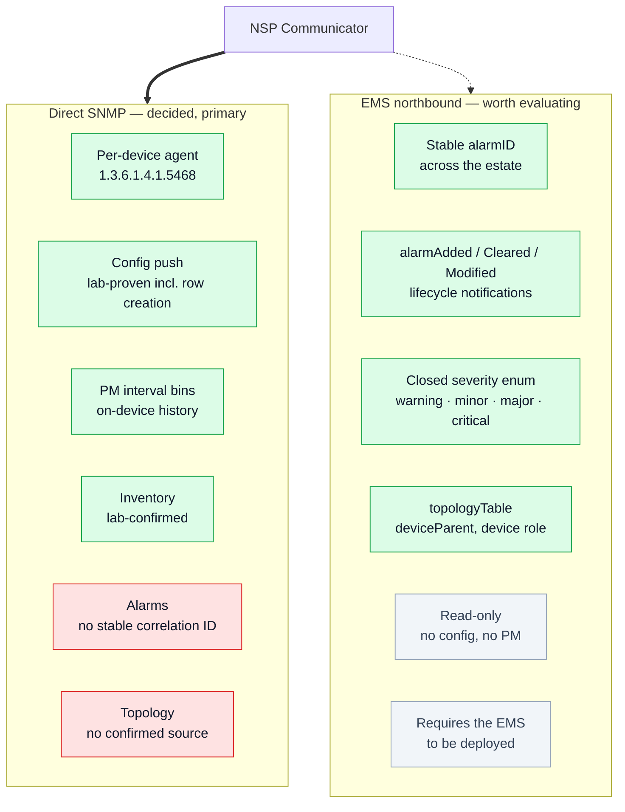

# ADR-0001 · Direct SNMP to each device, not via the Actelis EMS

**Status:** Accepted, with a revision — the original decision stands, but the
evidence base was incomplete and a hybrid is now recommended for fault and
topology.
**Supersedes:** `architecture-decision-direct-snmp.md` in the original repo.

## Context

The question: should the NSP Communicator talk to each Actelis device
directly, or proxy through the Actelis EMS the way some vendor NSP adaptors
are built?

The original ADR decided **direct SNMPv2c, no EMS**, and said the decision was
"Confirmed via MIB analysis". The supporting evidence is real and holds up:

* Both families run a resident SNMP agent under `1.3.6.1.4.1.5468` — verified.
* SNMP SET works directly for config push — lab-proven on the switch,
  including genuine row creation via `VTSSRowEditorState`.
* Trap destinations are remotely configurable per device.
* No EMS licence, EMS availability, or EMS API version becomes a dependency.

## What the original ADR missed

`ML600_MIB.7z` — committed to the repo — contains `NMS-ALARM-MIB.MY`, the
Actelis **MetaAssist EMS northbound OSS interface** at `1.3.6.1.4.1.5468.9.1`:

> *"NMS Server Open Alarms enable external OSS to read the open alarms table
> and receive trap for any alarm change"*

It provides, across the whole estate through one endpoint:

| Object | Significance |
|---|---|
| `alarmID` (Unsigned32) | A **stable correlation key** for raise → modify → clear |
| `alarmSeverity` | Closed enum `warning(3) minor(4) major(5) critical(6)` — X.733 ordering |
| `alarmSource`, `alarmManagedObject`, `alarmType` | Normalised object naming |
| `alarmAdded` / `alarmCleared` / `alarmModified` | Proper lifecycle notifications |
| `topologyTable` | `deviceParent`, `deviceType` (`bst-central`/`bst-remote`/`cpe`/`backhaul`) |

Those map onto the three genuine weaknesses of the direct-SNMP design:

1. **No stable alarm identity.** The switch's `currentAlarmRowId` is a
   reusable slot number; the modem's `alarmIndex` is a table position. Neither
   is a durable correlation key, which is why the prototype had to synthesise
   one from alarm type plus entity.
2. **No clear semantics on the modem.** `ACTELIS-ALARM-MIB` has
   `alarmRaised`/`alarmCleared` traps, but the polled table has no state
   column equivalent to the switch's `alm-Cleared(2)`.
3. **No topology source.** The ADR assumed LLDP; the tested firmware does not
   implement the proprietary LLDP status subtree at all.

An ADR that does not mention the alternative it rejected will not survive
review by anyone who opens that archive.

## The two paths

The green boxes on each side are what that path does well. The direct path's
two weaknesses are precisely what the EMS interface covers — which is why the
recommendation is a hybrid rather than a choice.

## Decision

**Keep direct SNMP as the primary path** — for configuration, performance and
inventory it is clearly better: no EMS dependency, per-device granularity,
proven writes, and it is the only path that works if the EMS is not deployed
everywhere in the estate.

**Additionally, evaluate the EMS northbound interface for fault and
topology**, rather than treating "direct SNMP" as excluding it. The two are
not mutually exclusive: NSP can take alarms from one source and configuration
from another, and the EMS interface is read-only, so it adds no write-path
risk.

Open questions that decide it — none answerable from MIBs alone:

* Is the Actelis EMS actually deployed in this estate, and will it stay?
* Does it cover the whole estate or only part of it?
* Does `alarmID` survive an EMS restart?
* Does the topology table reflect real adjacency, or only EMS-registered
  parent/child relationships?

These are now question 1 in `docs/vendor-questions/actelis.md`.

## Consequences

* Per-device credential and session management (unchanged from the original).
* Alarm correlation must be synthesised locally on the direct path — done in
  `model/alarms.py`, and it works, but a vendor-supplied `alarmID` would be
  strictly better.
* Topology has no confirmed source yet. Three candidates, in cost order:
  standard `LLDP-MIB` on the switch (untested — ADR-0002 lab item), the EMS
  `topologyTable`, or NSP-side manual/inferred topology.
* If the EMS is not deployed, nothing is lost: the direct path is complete on
  its own and the hybrid is an enhancement, not a dependency.
