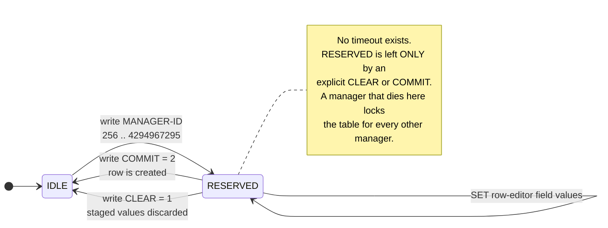

# ADR-0004 · The row editor is a device-wide mutex with no timeout

**Status:** Accepted — constrains NSP deployment topology.

## Context

`VTSSRowEditorState` (`ML540M-TC.mib`) is the mechanism for creating rows in
63 tables on the ML540M. The protocol is proven end-to-end
(`docs/lab-results/ml540m-row-editor-20260918.txt`). Its state machine,
verbatim from the textual convention:

Reading the state back returns `0` when idle, or the holding manager's ID —
never `1` or `2`. Verbatim from the textual convention:

Two properties follow that the original analysis did not draw out:

1. **There is no timeout.** `RESERVED` is left only by an explicit CLEAR or
   COMMIT. A manager that dies between reserve and commit leaves the editor
   reserved indefinitely.
2. **It is per-table and device-wide.** Any manager — NSP, the CLI, a
   technician's MIB browser, another NMS — contends for the same editor.

A stuck reservation therefore blocks row creation on that table for
*everyone*, permanently, until someone writes CLEAR.

## Decision

1. **Always use the session helper**, never raw SETs. `RowEditorSession`
   clears the reservation on any exception inside its block.
2. **Provide programmatic recovery.** The TC places no restriction on who may
   write CLEAR, so recovery does not require a device reboot or CLI access.
   `reclaim_stale=True` force-clears with a warning. It is opt-in because it
   does stamp on whoever holds the editor.
3. **Treat write access as singly-owned.** Only one NSP Communicator instance
   may hold write access to a given device at a time. NSP normally runs
   clustered, so this must be an explicit question to Nokia: how does the
   Communicator framework serialise writes across cluster members?
4. **Hold reservations for as short a time as possible.** Reserve, stage,
   commit in one sequence; never hold across an operation that can block.

## Consequences

* An open question for Nokia (now question 15 in the Nokia doc): write
  serialisation across a clustered Communicator.
* A pre-flight check is worth adding before any bulk provisioning run: walk
  every row-editor Action scalar and confirm all are `0`. A non-zero value
  means someone is mid-edit — or something died mid-edit.
* Operational runbook item: "row creation fails with `RowEditorBusy`" should
  resolve to "check for a stuck reservation, confirm nobody is editing, then
  reclaim" rather than "reboot the switch".

## Note on the Action sub-identifier

The proven community table puts the row-editor Action at sub-identifier
`.100`. That is a convention, not a rule: across the 63 row-editor tables the
MIBs use `.100` (51 tables), `.101` (6) and `.10000` (6). Hand-written specs
assuming `.100` would silently target a *field* OID on a fifth of the tables.
This is why `src/actelis_mediation/rowedit/specs.py` is generated from the
MIBs rather than written by hand.
