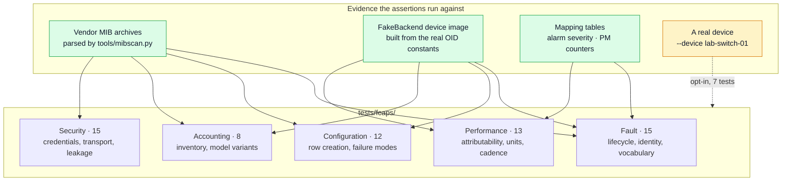

# FCAPS test plan

`docs/fcaps-parity.md` says the FCAPS breakdown should be "the acceptance
checklist" for EMS parity. This makes that checklist executable: 63 tests in
`tests/fcaps/`, one module per pillar, each assertion written as an acceptance
criterion rather than a unit test of an implementation detail.



## Running it

```bash
# offline — the default; 56 tests, no network, no net-snmp, no device
pytest tests/fcaps/ -v

# one pillar
pytest tests/fcaps/test_fault.py -v

# include the 7 hardware-gated tests against a real unit
export LAB_SWITCH_RO=... LAB_SWITCH_RW=...
pytest tests/fcaps/ -v --device lab-switch-01 --device-config etc/devices.yaml

# everything except tests that write to the device
pytest tests/fcaps/ --device lab-switch-01 -m "not writes"
```

Markers: `fcaps(pillar)`, `hardware` (skipped without `--device`), `writes`
(performs an SNMP SET against a real device).

## Why two modes matter

An acceptance suite that only ever runs against a mock proves the mock. Each
assertion is therefore written once and runs in whichever mode is available:
offline against a device image built from the same OID constants the pollers
use, and — with `--device` — against a real unit through the net-snmp backend.

The split is honest about what each proves:

| | Offline | Hardware |
|---|---|---|
| Decoding, mapping, state machines | **proves it** | confirms it |
| MIB-derived claims (types, indices, enums) | **proves it** | n/a |
| Agent behaviour, populated tables, firmware gaps | cannot prove | **proves it** |

## What each pillar asserts

### Fault — 15 tests

The question is not "does the alarm table respond" but "is the output usable
by a fault manager".

* Alarm rows from both families decode to normalised alarms with severity,
  probable cause and a key.
* Severity vocabulary is closed — a typo in the mapping CSV fails the build.
* **Lifecycle:** raise once, stay silent while standing, clear exactly once.
* **Stable identity:** the same fault at a different `currentAlarmRowId`
  stays one alarm. Row IDs are reusable slot numbers, so keying on them would
  produce a spurious clear-and-raise on every device reboot.
* **Path convergence:** a port-7 link-down seen by trap and by poll produces
  the *same* alarm key. If it did not, a trap would raise an alarm no poll
  could ever clear.
* Restart does not replay standing alarms as new.
* **Coverage limits asserted from the MIBs:** link-down traps exist for GE
  ports 1–10 only while the table covers 25, and only `ML540M-SYSTEM-MIB`
  defines notifications. Both are design constraints that must not be
  forgotten, so they are tests rather than prose.

### Configuration — 12 tests

Row creation is the proven capability; these guard its generalisation.

* The reserve → stage → commit sequence matches the lab-proven one, with the
  proven `s`/`a`/`i` types.
* **Every staged field's type matches its MIB SYNTAX**, across all 64 specs —
  this is the defect that made the original helper unusable, asserted
  everywhere rather than on the one hand-written spec.
* Every staged field is genuinely `read-write` or `read-create`.
* **Coverage:** all 64 row-editor tables in the MIB set have a generated spec.
* **Failure modes that leave the device worse off:** a failed stage releases
  the reservation; a reservation held elsewhere is refused with the holder
  named; a stale reservation is recoverable without a reboot; a rejected
  commit raises rather than reporting success.
* Hardware: a pre-flight check that *every* row editor on the device is idle —
  worth running before any bulk provisioning.

### Accounting — 8 tests

For this platform the pillar means inventory; no usage/billing MIB exists.

* Identity populates for both families.
* **`servMonSystemModel` yields the model variant** — the mechanism that lets
  one Device Model cover the whole ML600 family.
* **ADR-0003 as an assertion:** ML622 and ML684 are present in the `Models`
  enum and ML540 is not. If a MIB revision changes that, the two-device-type
  scoping decision gets revisited instead of silently rotting.
* Partial identity degrades gracefully and records a capability gap.
* Re-polling does not grow the inventory record.
* `ENTITY-MIB` is present and unused — the gap stays visible.

### Performance — 13 tests

* **Attributability:** every DSL sample carries `ifIndex`, `invIndex`,
  `endpointSide`, `wirePair` and `intervalNumber`; bins from different ports
  or wire pairs never collide. An archive of unattributable bins is not PM
  data, which is what the original produced.
* **Archive integrity:** polling 96 bins five times stores 96 bins.
* **Cadence:** the configured `pm_interval_s` beats the tightest on-device
  window with margin. The ML600 EVC counters keep only `Curr`/`Prev`, so a
  slow poll loses a completed interval permanently.
* **Units:** each stated scale is checked against the MIB's own worked
  example; measured FLR and the MEF-10.2 objective are asserted to differ
  (the 10× trap); the DM unit is read per row; an unstated scale is never
  applied and an unrecognised one never defaults.

### Security — 15 tests

* **The repo itself:** no factory-default communities in config or source,
  `etc/devices.yaml` untracked, credentials resolved from the environment,
  missing env var fails loudly.
* **Leakage:** the community never reaches an exception message, a log
  record, or a chained exception's context. One of these found a real leak —
  `subprocess.TimeoutExpired` stringifies its own argv, so `raise ... from
  None` suppressed the *display* but left the credential reachable on
  `__context__`.
* **Retry safety:** authorization failures and rejected writes are never
  retried — the former risks lockouts on AAA-backed devices, the latter risks
  double-applying a change.
* **Platform capability:** the ML540M supports SNMPv3 USM with SHA/AES and
  `authPriv`, contradicting the original premise. Asserted from the MIBs, so
  the posture cannot quietly regress to "v2c is all we have".
* The write community is readable over SNMP — documented as a bootstrap
  convenience in the original, asserted here as what it also is: RO access
  escalating to RW.
* Hardware: the device is not on factory defaults, and its SNMP version
  setting is reported (`xfail` if still v2c — a target, not a failure).

## What this suite deliberately does not do

* **It does not prove the trap decoder.** No trap payload has ever been
  captured from either family. The trap tests assert that a *synthetic* trap
  built from the MIB's `OBJECTS` clause converges with the poll path — useful,
  but it proves internal consistency, not wire format. Closing that needs
  `docs/testing-strategy.md` L3, about twenty minutes in the lab.
* **It does not assert NSP-side behaviour.** Severity labels, probable-cause
  taxonomy and PM timestamp semantics are all questions to Nokia. The
  severity enum lives in one place (`model/alarms.py`) precisely so it can be
  swapped once confirmed, and the suite will then check the real vocabulary.
* **It does not test the ML600 family against hardware**, because no unit has
  ever been reachable. Every ML600 assertion is MIB-derived or runs against
  the device image.
