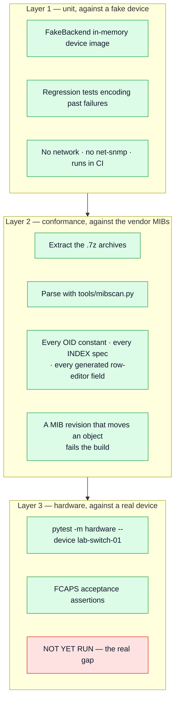

# Testing strategy

## Where the original stood

42 tests, all passing, several built from output lifted verbatim out of the
real lab captures rather than hand-written fixtures. That is a good instinct
and it is kept and extended here.

The gap was not test count but **test reach**: every test exercised the code's
own assumptions. Nothing checked the code against the *MIBs*, so the index
truncation (F-01), the wrong-type staging (F-02) and the unit-inference dead
code (F-16) all passed a green suite. A test suite that only asks "does the
code do what the code intends" cannot catch a wrong intention.

## The three layers now



Layer 1 catches "does the code do what it intends". Layer 2 catches "is the
intention right" — the layer whose absence let three defects pass a green
suite. Layer 3 catches "does the device actually behave that way", and is
still the honest gap.

### 1. Unit tests against a fake device — 54 tests, no network, no net-snmp

`snmp/backend.py` provides `FakeBackend`, an in-memory device image. Tests
construct the OID/value pairs a real agent would return and assert on decoded
output. Fast, deterministic, runs anywhere.

The valuable ones are the regression tests that encode a *specific* past
failure:

* two DM rows sharing an `entryId` across different intervals, with different
  `DmUnit` values (the 1000× bug);
* the generated community spec reproducing the lab-proven `s`/`a`/`i` types;
* a `No Such Instance` inside a multi-OID GET not destroying the good values;
* re-polling 96 identical bins three times yielding 96 rows, not 288.

### 2. Conformance tests against the vendor MIBs — the layer that was missing

`tests/test_mib_conformance.py` extracts the `.7z` archives, parses them with
`tools/mibscan.py`, and checks:

* every OID constant in `poll/oids.py` resolves to the MIB object it claims;
* every `IndexSpec` matches the `INDEX` clause of its `...Entry`;
* every generated row-editor field OID is a real, **writable** MIB object.

This turns firmware/MIB drift from a code-review problem into a build
failure. It is also what would have caught F-01 on day one.

### 3. Hardware validation — still the real gap

Unchanged from the original's honest assessment, and worth restating plainly:
**nothing in the Communicator has ever run against a device.** The bash
validation scripts have; the Python has not. Until that happens, "the OIDs
are right" is proven and "the collection works" is not.

## The FCAPS acceptance suite

Layered on top of the three levels above, `tests/fcaps/` expresses the FCAPS
parity analysis as 63 executable acceptance criteria — one module per pillar,
each assertion phrased as "what must be true for NSP to be able to use this"
rather than as a unit test. 56 run offline; 7 are hardware-gated behind
`--device`. Full breakdown in [`fcaps-test-plan.md`](fcaps-test-plan.md).

Writing it found two defects that the existing suite could not have caught,
which is the argument for acceptance tests in a sentence:

* 12 of 50 alarm-mapping rows carry a prose cross-reference in the
  `nsp_severity` column rather than a severity; the pollers called
  `Severity(row.nsp_severity)` on it, which raises `ValueError` and would have
  taken down a polling cycle on a live modem.
* `subprocess.TimeoutExpired` stringifies its own argv, so the community
  string survived on the chained exception's `__context__` even after the
  message itself was redacted.

## Lab checklist

Ordered by value per minute.

**L1 · Run `poll-once` against the lab switch** (~5 min)
```bash
export LAB_SWITCH_RO=... LAB_SWITCH_RW=...
actelis-mediation --config etc/devices.yaml poll-once --device lab-switch-01 -v
actelis-mediation --config etc/devices.yaml alarms  --device lab-switch-01
```
Watch for: walk durations, whether `snmpbulkwalk` is accepted, whether the
Y.1731 PM tables are populated at all on firmware `00.00.16`, and what
`capability_gaps` records.

**L2 · Standard LLDP-MIB** (~5 min) — retires or confirms the topology risk.
```bash
snmpwalk -v2c -c "$LAB_SWITCH_RO" -On 192.168.1.99 1.0.8802.1.1.2.1.4
```
The proprietary branch (`1.3.6.1.4.1.5468.100.34.1.3.2`) returned `No Such
Object`. The standard MIB ships in the vendor's own ML600 archive and was
never tried.

**L3 · Capture a real trap** (~20 min) — the least-evidenced component.
```bash
snmptrapd -Lo -On -f -Oq -c snmptrapd.conf   # disableAuthorization yes
# then, from another shell, admin-down a port and bring it back
```
**Keep the raw output line.** Add it verbatim to `tests/fixtures/` and write a
test against it. That converts the trap decoder from a design sketch into
something proven, and it is a one-off cost.

**L4 · Verify the PM bin identity end to end** (~10 min) — walk one
`hdsl2Shdsl15MinIntervalTable` column on a modem when one is available and
confirm the five-component index decodes as
`ifIndex / invIndex / endpointSide / wirePair / intervalNumber`. This is the
fix for the most serious defect and it is only unit-tested.

**L5 · Deliberately stick the row editor** (~10 min) — reserve it, kill the
process, confirm the reservation persists, confirm `reclaim_stale=True`
recovers it. Better learned in a lab than during a change window.

**L6 · Verify `community_mode: snmp_conf`** (~10 min) — confirm the community
reaches net-snmp via `SNMPCONFPATH` and does not appear in `ps`.

## What to build when the lab runs out of answers

`ROADMAP.md` X3: a simulator seeded from the OID maps and the lab captures.
One switch and no modem is not enough surface to test against, and some
conditions — a bin rolling over mid-poll, a subtree disappearing after a
firmware upgrade, a stuck row editor — cannot be provoked on demand on real
hardware. Everything needed to seed it is already in the repo.
